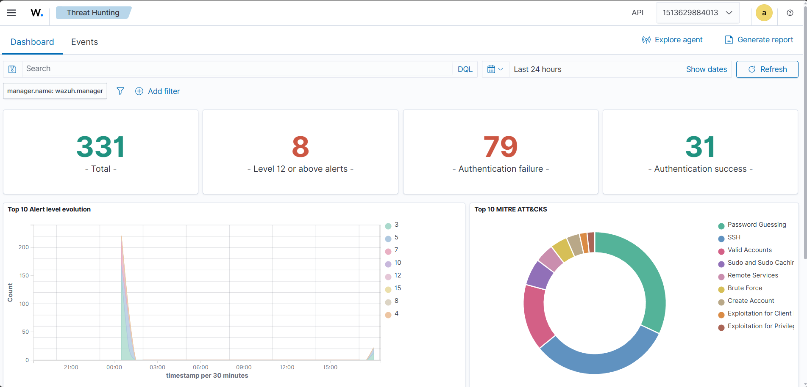
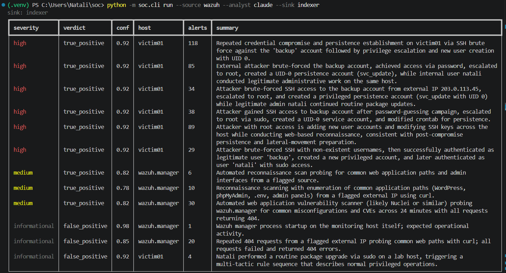

# SOCtriage

[](https://github.com/natalimuca/SOCtriage/actions/workflows/ci.yml)

Alert triage for a Wazuh SIEM. Alerts are correlated into incidents, enriched with asset and
rarity context, and sent to Claude for a verdict, a severity, an ATT&CK mapping tied to
evidence, and an escalation decision. Every run is scored against a labelled corpus and
against a threshold baseline, so the question "is the model actually better than sorting by
rule level" has an answer rather than a demo.

The stack is real. `docker/` brings up a Wazuh manager, indexer, and dashboard, plus a
generator container that writes attack and benign activity into a log volume the manager
monitors. Wazuh's own decoders and rules produce the alerts; nothing about the detection is
simulated on the Python side.

## The problem



This is what a SIEM hands an analyst: 331 alerts in a day, 79 authentication failures, 31
successes, and a chart of which ATT&CK techniques fired. It cannot tell you whether any of
those 31 successes followed the 79 failures on the same host inside three minutes, which is
the difference between background noise and an intrusion. Answering that is a person reading
alerts one at a time.



Same alerts, after the pipeline. Four incidents, two worth escalating, 4.8 cents, and the
first line names the account, the source address, the privilege escalation, the backdoor
account and its UID, and the persistence mechanism. That is 118 alerts collapsed into one
paragraph a human can act on.

## Flow

```
generator container ──► /var/log/lab/*.log ──► wazuh.manager (decoders + rules)
                                                     │
                                                filebeat
                                                     ▼
                                              wazuh.indexer  ◄── WazuhSource (REST)
                                                                      │
                                          correlate ──► enrich ──► triage ──► report
                                          (per host,   (asset,     (Claude    (markdown
                                           time gap)    rarity,     or rule     + JSONL)
                                                        ATT&CK)     baseline)
```

`JsonlSource` swaps in for `WazuhSource` behind the same interface, which is how the
evaluation runs without the stack.

## Setup

```bash
python -m venv .venv && .venv/Scripts/python.exe -m pip install -e ".[dev]"
```

```bash
cp .env.example .env
```

Set `ANTHROPIC_API_KEY` in `.env`. Then pull the ATT&CK matrix once:

```bash
.venv/Scripts/python.exe -m soc.cli sync
```

## The stack

Certificates are generated once, then the stack comes up:

```bash
docker compose -f docker/generate-indexer-certs.yml run --rm generator
```

```bash
.venv/Scripts/python.exe -m soc.cli stack up
```

Four containers: `wazuh.manager`, `wazuh.indexer`, `wazuh.dashboard` (https://localhost:8443,
`admin` / `SecretPassword`), and `victim`, which fires one of six scenes every ninety seconds.
Three scenes are attacks (credential guessing that succeeds and creates an account, a web
shell delivered after a scan, cron persistence pulling a remote script), three are benign
(admin maintenance, internet background noise, a failing backup job). Fire one on demand:

```bash
docker compose -f docker/docker-compose.yml exec victim python scenes.py --scene web_shell
```

The passwords in `docker/` are the defaults shipped with Wazuh's own single-node example and
are committed on purpose so the lab comes up in one command. They protect nothing but a
throwaway container; change them before pointing this at anything real. Credentials that
matter live in `.env`, which is not tracked.

The indexer needs `vm.max_map_count` at 262144 inside the Docker VM. On Docker Desktop:
`wsl -d docker-desktop -e sh -c 'echo 262144 > /proc/sys/vm/max_map_count'`.

## Running

Triage what is in the indexer now:

```bash
.venv/Scripts/python.exe -m soc.cli run --source wazuh --analyst claude
```

Follow the stack continuously:

```bash
.venv/Scripts/python.exe -m soc.cli watch --interval 60
```

Both write one markdown report per incident, a `summary.md` ranked by severity, and
`results.jsonl` into `out/`. Compliance and inventory alerts (`sca`, `rootcheck`,
`vulnerability-detector`, `syscollector`) are excluded by default: a fresh Wazuh manager
produces about two hundred of them at first boot and they are a posture report, not events.

## Evaluation

`eval/alerts.jsonl` is 39 Wazuh-shaped alerts forming 14 labelled cases: six true positives
(credential access ending in account creation, web shell, cron persistence, staged
exfiltration from the database, lateral movement by new SSH key, local privilege escalation),
six false positives (package upgrade file-integrity burst, admin maintenance, internet noise,
nightly backup failure, scanner 404s, CI workspace churn), and two genuinely ambiguous cases
where the honest answer is `inconclusive` with an escalation.

```bash
.venv/Scripts/python.exe -m soc.cli eval --analyst claude
```

```bash
.venv/Scripts/python.exe -m soc.cli eval --analyst rules
```

The corpus is regenerated from `eval/make.py`, which holds the alerts and the labels
together so a case and its ground truth cannot drift apart.

### Metrics

Escalation precision and recall matter most: a missed escalation is an incident nobody looks
at, a false one is analyst time. Alongside those the harness scores verdict accuracy, severity
(exact and within one band), micro-averaged ATT&CK technique precision and recall, and a
Brier score over the model's stated confidence, which catches an analyst that is right often
but certain always. It also reports correlation purity, the fraction of incidents whose
alerts all belong to one case, so a correlation bug cannot hide inside a triage score.

### Baseline

`--analyst rules` is severity from Wazuh rule level, escalation above level 10, techniques
copied from whatever the firing rules asserted. It exists to be beaten:

| metric | rules baseline | haiku 4.5 | haiku, revised playbook |
| --- | --- | --- | --- |
| escalation F1 | 0.800 | 0.714 | **0.875** |
| escalation misses | 2 | 3 | **1** |
| escalation false alarms | 1 | 1 | 1 |
| verdict accuracy | 0.500 | 0.786 | **0.857** |
| severity exact | **0.571** | 0.429 | 0.500 |
| severity within one band | 0.714 | **0.857** | **0.857** |
| technique F1 | **0.909** | **0.909** | 0.903 |
| Brier | 0.250 | 0.165 | **0.138** |
| correlation purity | 1.000 | 1.000 | 1.000 |
| cost per incident | $0 | $0.006 | $0.007 |
| latency p50 | 0 ms | 11,420 ms | 10,208 ms |

Correlation purity is identical by construction: correlation runs before either analyst is
called, so it measures the pipeline, not the model.

The baseline is deliberately not weak. Rule level alone gets escalation F1 to 0.8 on this
corpus, and copying rule-asserted techniques scores 0.909 because Wazuh's own ATT&CK mapping
is decent. Verdict accuracy is where it collapses: a threshold cannot tell a package upgrade
from an attacker, so it sits at 0.500 and reports 0.5 confidence on everything, which is what
the Brier score of 0.250 measures. Technique F1 ties at 0.909 because both analysts start
from the same rule assertions and neither adds or drops enough to separate them.

### What the model actually did

On the playbook as originally written, Haiku 4.5 **lost to the threshold baseline** on the
metric that matters most: escalation F1 of 0.714 against 0.800. It understood the incidents
far better, verdict accuracy 0.786 against 0.500 and a Brier score of 0.165 against 0.250, and
it cleared five of six false positives while naming the benign mechanism in each. But every
point of the escalation loss came from one behaviour: **it treated uncertainty as a reason not
to escalate.** All three misses were cases where the honest verdict is `inconclusive` and the
correct action is to hand it to a human anyway.

The second pattern was severity inflation. Four of six true positives came back `critical`
where the label says `high`, which is why exact severity accuracy sat at 0.429, below the
baseline, while within-one-band was 0.857, above it. Not confused about how bad things are,
just consistently one band hot.

Neither failure was really about the model. The playbook said when to escalate a `medium` but
never said an `inconclusive` verdict is itself grounds for escalation, and it defined
`critical` without saying it should be rare. So both got written into the playbook and the
eval was run again on the same corpus with the same model.

**One fix worked and the other did not.**

Stating that uncertainty escalates moved escalation F1 from 0.714 to 0.875, past the baseline,
cutting misses from three to one. It carried verdict accuracy up to 0.857 and the Brier score
to 0.138 as a side effect: told that `inconclusive` is a usable answer with a real action
attached, the model stopped forcing thin evidence into a confident `false_positive`.

Telling it `critical` must stay rare, with an explicit "would you wake someone at 03:00" test,
barely moved anything. Exact severity went 0.429 to 0.500 and the same four intrusions still
come back `critical`. Severity inflation is not a gap in the instructions, so writing better
instructions does not fix it. A rubric anchored to worked examples, or a calibration pass over
labelled incidents, would be the next thing to try.

Two failures survive at the revised playbook. `scanner_404s`, a 404 sweep with no successful
response, still gets promoted to a true positive. `offhours_useradd`, an unexplained 02:00
root account creation, is still called a false positive at 0.92 confidence, and it is the only
remaining escalation miss. Both are cases where the model asserts more than the evidence
carries, in opposite directions, which is also why `confidence_when_wrong` (0.885) is now
indistinguishable from `confidence_when_right` (0.883): what calibration it has comes from
being right more often, not from knowing when it is not.

Reproduce with:

```bash
python -m soc.cli eval --analyst claude
```

Per-case detail lands in `eval/scores.json`, showing exactly which cases each analyst got
wrong and what it said. `eval/scores-haiku-before.json` is the same run against the earlier
playbook, kept so the two are diffable. Fourteen incidents cost about nine cents on Haiku 4.5.

## Design notes

The playbook in `soc/playbook.md` is the entire system prompt and it never changes between
calls, so it sits in a single cached system block with a one-hour TTL. Everything volatile
(the incident, the ATT&CK reference for its techniques) goes in the user message, after the
cache breakpoint. `soc eval` prints cached input tokens so a silent cache invalidation shows
up as a cost regression rather than going unnoticed.

Requests run on `claude-opus-5` at `high` effort with adaptive thinking, through
`client.beta.messages.parse` with the `Triage` pydantic model as the output schema, so the
verdict, severity, confidence, and technique list are validated on arrival instead of parsed
out of prose. Server-side fallbacks are enabled: this workload asks a model to reason in
detail about intrusion technique, and an occasional policy decline on a live alert queue
should degrade to another model rather than drop the incident. A refusal that survives the
fallback is turned into an `inconclusive` verdict flagged for escalation, never a silent
skip.

Enrichment is deliberately small and local. `assets.yml` carries criticality, exposure, and
owner per host, which is what moves severity. `data/baseline.json` counts how often each host
has produced each rule, which is what separates a first-ever alert from nightly noise; it
learns on every `run` and `watch`, and is frozen during `eval` so scores are not affected by
the order cases happen to arrive in. `indicators.txt` is a flat list of addresses seen in
prior confirmed incidents.

Correlation groups alerts per host with a ten-minute gap between them. This is the crudest
part of the system and the metric that watches it is `correlation_purity`.

## Limits

Fourteen cases is a small corpus, and I wrote both the alerts and the labels, so it measures
agreement with one analyst's judgement rather than ground truth from a real environment.
Treat the numbers as a regression harness for changes to the prompt, model, or enrichment,
not as evidence about production performance. Feeding it real labelled alerts is the obvious
next step and nothing in the pipeline needs to change to do it.

The lab generator writes log lines rather than performing the attacks, so Wazuh's decoders
and rules are exercised end to end but its file-integrity and rootcheck modules are not.
Alerts are attributed to the syslog hostname in the line, which is how a single manager
container can stand in for several hosts.
