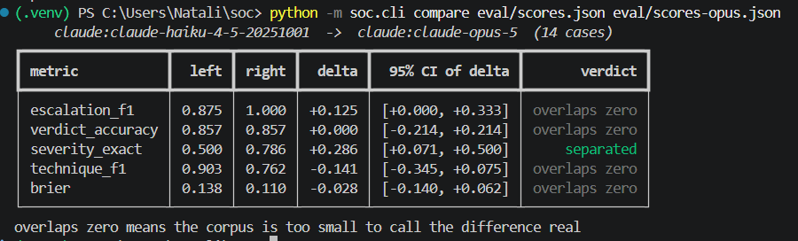

# SOCtriage

[](https://github.com/natalimuca/SOCtriage/actions/workflows/ci.yml)

Alert triage for a Wazuh SIEM. Alerts are correlated into incidents, enriched with asset and
rarity context, and sent to Claude for a verdict, a severity, an ATT&CK mapping tied to
evidence, and an escalation decision. Every run is scored against a labelled corpus and
against a threshold baseline, so the question "is the model actually better than sorting by
rule level" has an answer rather than a demo.

The stack is real. `docker/` brings up a Wazuh manager, indexer, and dashboard, plus a
generator container that writes attack and benign activity into a log volume the manager
monitors. Wazuh's own decoders and rules produce the alerts; nothing about the detection is
simulated on the Python side.

## The problem


This is what a SIEM hands an analyst: 331 alerts in a day, 79 authentication failures, 31
successes, and a chart of which ATT&CK techniques fired. It cannot tell you whether any of
those 31 successes followed the 79 failures on the same host inside three minutes, which is
the difference between background noise and an intrusion. Answering that is a person reading
alerts one at a time.


Same alerts, after the pipeline. Four incidents, two worth escalating, 4.8 cents, and the
first line names the account, the source address, the privilege escalation, the backdoor
account and its UID, and the persistence mechanism. That is 118 alerts collapsed into one
paragraph a human can act on.

## Flow

```
generator container ──► /var/log/lab/*.log ──► wazuh.manager (decoders + rules)
                                                     │
                                                filebeat
                                                     ▼
                                              wazuh.indexer  ◄── WazuhSource (REST)
                                                                      │
                                          correlate ──► enrich ──► triage ──► report
                                          (per host,   (asset,     (Claude    (markdown
                                           time gap)    rarity,     or rule     + JSONL)
                                                        ATT&CK)     baseline)
```

`JsonlSource` swaps in for `WazuhSource` behind the same interface, which is how the
evaluation runs without the stack.

## Setup

```bash
python -m venv .venv
```

Activate it. On Windows PowerShell:

```bash
.venv\Scripts\Activate.ps1
```

On macOS or Linux:

```bash
source .venv/bin/activate
```

```bash
pip install -e ".[dev]"
```

```bash
cp .env.example .env
```

Every command below assumes that environment is active. Set `ANTHROPIC_API_KEY` in `.env`,
then pull the ATT&CK matrix once:

```bash
python -m soc.cli sync
```

## The stack

Certificates are generated once, then the stack comes up:

```bash
docker compose -f docker/generate-indexer-certs.yml run --rm generator
```

```bash
python -m soc.cli stack up
```

Four containers: `wazuh.manager`, `wazuh.indexer`, `wazuh.dashboard` (https://localhost:8443,
`admin` / `SecretPassword`), and `victim`, which runs a real Wazuh agent and fires one of eight
scenes every two minutes. The attack scenes perform real actions on the host, credential
guessing that lands and creates a UID-0 account, a web shell written into a monitored web root,
cron persistence, an `/etc/passwd` edit, an SSH key drop, so the agent's own file-integrity and
rootcheck modules detect them. Benign scenes cover admin maintenance, background noise, and
scanner 404s. Fire one on demand:

```bash
docker compose -f docker/docker-compose.yml exec victim python3 /opt/attacks.py --scene web_shell
```

The agent installs and enrols itself against the manager on first boot, so the stack takes a
couple of minutes to produce its first agent-side alerts. Endpoint protection on the host may
quarantine the web-shell payload in `docker/agent/attacks.py`; it is assembled at runtime to
avoid that, which is itself a sign the simulation is realistic enough to trip a real scanner.

The passwords in `docker/` are the defaults shipped with Wazuh's own single-node example and
are committed on purpose so the lab comes up in one command. They protect nothing but a
throwaway container; change them before pointing this at anything real. Credentials that
matter live in `.env`, which is not tracked.

The indexer needs `vm.max_map_count` at 262144. On Linux that is
`sudo sysctl -w vm.max_map_count=262144` on the host. On Docker Desktop it has to be set
inside the VM, and it resets when Docker restarts:

```bash
wsl -d docker-desktop -e sh -c 'echo 262144 > /proc/sys/vm/max_map_count'
```

## Running

Triage what is in the indexer now:

```bash
python -m soc.cli run --source wazuh --analyst claude
```

Follow the stack continuously:

```bash
python -m soc.cli watch --interval 60
```

Both write one markdown report per incident, a `summary.md` ranked by severity, and
`results.jsonl` into `out/`. Compliance and inventory alerts (`sca`, `rootcheck`,
`vulnerability-detector`, `syscollector`) are excluded by default: a fresh Wazuh manager
produces about two hundred of them at first boot and they are a posture report, not events.

## Evaluation

`eval/alerts.jsonl` is 39 Wazuh-shaped alerts forming 14 labelled cases: six true positives
(credential access ending in account creation, web shell, cron persistence, staged
exfiltration from the database, lateral movement by new SSH key, local privilege escalation),
six false positives (package upgrade file-integrity burst, admin maintenance, internet noise,
nightly backup failure, scanner 404s, CI workspace churn), and two genuinely ambiguous cases
where the honest answer is `inconclusive` with an escalation.

```bash
python -m soc.cli eval --analyst claude
```

```bash
python -m soc.cli eval --analyst rules
```

The corpus is regenerated from `eval/make.py`, which holds the alerts and the labels
together so a case and its ground truth cannot drift apart.

### Metrics

Escalation precision and recall matter most: a missed escalation is an incident nobody looks
at, a false one is analyst time. Alongside those the harness scores verdict accuracy, severity
(exact and within one band), micro-averaged ATT&CK technique precision and recall, and a
Brier score over the model's stated confidence, which catches an analyst that is right often
but certain always. It also reports correlation purity, the fraction of incidents whose
alerts all belong to one case, so a correlation bug cannot hide inside a triage score.

Every headline metric carries a 95% bootstrap interval, and `soc compare` runs a paired
bootstrap between two scored runs. Fourteen cases is small enough that a one-case change moves
a rate by seven points, so a harness that reported point estimates alone would mostly be
measuring which cases happened to be in it.

### Baseline

`--analyst rules` is severity from Wazuh rule level, escalation above level 10, techniques
copied from whatever the firing rules asserted. It exists to be beaten:

| metric | rules baseline | haiku, first playbook | haiku, revised | opus 5, revised |
| --- | --- | --- | --- | --- |
| escalation F1 | 0.800<br>[0.50, 1.00] | 0.714<br>[0.36, 0.93] | 0.875<br>[0.67, 1.00] | 1.000<br>[1.00, 1.00] |
| escalation misses | 2 | 3 | 1 | 0 |
| escalation false alarms | 1 | 1 | 1 | 0 |
| verdict accuracy | 0.500<br>[0.29, 0.79] | 0.786<br>[0.57, 1.00] | 0.857<br>[0.64, 1.00] | 0.857<br>[0.64, 1.00] |
| severity exact | 0.571<br>[0.29, 0.79] | 0.429<br>[0.14, 0.71] | 0.500<br>[0.21, 0.79] | 0.786<br>[0.57, 1.00] |
| severity within one band | 0.714 | 0.857 | 0.857 | 1.000 |
| technique F1 | 0.909<br>[0.77, 1.00] | 0.909<br>[0.73, 1.00] | 0.903<br>[0.75, 1.00] | 0.762<br>[0.57, 0.92] |
| Brier | 0.250<br>[0.25, 0.25] | 0.165<br>[0.03, 0.33] | 0.138<br>[0.01, 0.29] | 0.110<br>[0.03, 0.22] |
| cost per incident | $0.000 | $0.006 | $0.007 | $0.051 |
| latency p50 | 0 ms | 11,420 ms | 10,208 ms | 31,736 ms |

Square brackets are 95% bootstrap intervals over the fourteen cases. They are wide because
fourteen is a small number, and they are printed first because every claim below has to
survive them.

## What survives the intervals

A point estimate on fourteen cases is one or two incidents away from a different number, so
the harness also does a **paired bootstrap**: resample the cases, rerun both analysts over the
same resample, and look at the distribution of the difference. If that interval contains zero,
the corpus cannot tell the two apart.

```bash
python -m soc.cli compare eval/scores.json eval/scores-opus.json
```



Running it against the three comparisons this repo actually made:

| comparison | metric | delta | 95% CI of delta | verdict |
| --- | --- | --- | --- | --- |
| haiku, playbook fix | escalation F1 | +0.161 | [+0.000, +0.444] | overlaps zero |
| haiku, playbook fix | verdict accuracy | +0.071 | [+0.000, +0.214] | overlaps zero |
| haiku, playbook fix | Brier | -0.028 | [-0.079, +0.006] | overlaps zero |
| haiku vs opus | escalation F1 | +0.125 | [+0.000, +0.333] | overlaps zero |
| haiku vs opus | severity exact | +0.286 | [+0.071, +0.500] | **separated** |
| haiku vs opus | technique F1 | -0.141 | [-0.345, +0.075] | overlaps zero |
| haiku v1 vs opus | escalation F1 | +0.286 | [+0.067, +0.636] | **separated** |
| haiku v1 vs opus | severity exact | +0.357 | [+0.143, +0.643] | **separated** |

**Two things survive, and they are both about model capability, not prompting.** Opus is
better at severity than Haiku, and against the original playbook it is better at escalation.
Everything else in this repo is inside the noise of a fourteen-case corpus.

That includes the result this project was built to produce. Writing "escalate every
`inconclusive` verdict" into the playbook moved Haiku's escalation F1 from 0.714 to 0.875 and
cut misses from three to one, and I first wrote that up as the fix working decisively. The
paired bootstrap puts the interval at [+0.000, +0.444]. Two cases changed. The direction is
right, the mechanism is plausible, and the corpus cannot establish it. It stays in the README
as a hypothesis worth testing on more data, not as a finding.

The same correction applies in the other direction. Opus's technique F1 looks 0.141 lower, but
that interval is [-0.345, +0.075] and it is not established either. On inspection the gap is
not really about ATT&CK at all: Opus's recall is 1.000, and it loses precision by adding
techniques the labels do not carry, most of which are defensible. It tags the scanner sweep
`T1595 Active Scanning`, the pkexec crash `T1068 Exploitation for Privilege Escalation`, and
the `mysqldump --all-databases` staging `T1005 Data from Local System`. The labels omit those
because of a convention I chose, minimal sets on true positives and empty sets on false
positives, so **`technique_f1` partly measures agreement with that convention rather than
correctness.** Fixing it needs multi-annotator labels or credit for defensible supersets, and
neither is in this repo.

What is left that is solid: every LLM run beats the threshold baseline on verdict accuracy by
a wide margin, and the baseline's Brier score of 0.250 is what a constant 0.5 confidence
looks like. Opus escalates all fourteen cases correctly with a degenerate interval, because
there is no case for the bootstrap to resample into an error. That is a real ceiling on this
corpus and also evidence that the corpus is too easy for it.

## Cost

Opus costs 7x per incident, $0.051 against $0.007, and 3x the latency, 32 seconds against 10.
The one difference the corpus can actually establish, severity accuracy, is not the metric a
SOC lives or dies by. If a missed escalation is the expensive failure, neither model is shown
to be better than the other at avoiding one, and the cheap one is the reasonable default until
a larger corpus says otherwise.

Reproduce with:

```bash
python -m soc.cli eval --analyst claude
```

```bash
python -m soc.cli eval --analyst claude --model claude-opus-5 --out eval/scores-opus.json
```

```bash
python -m soc.cli compare eval/scores-haiku-before.json eval/scores.json
```

Per-case detail lands in the scores file, showing exactly which cases each analyst got wrong
and what it said. Four runs are committed so they are diffable: `eval/scores-rules.json`,
`eval/scores-haiku-before.json` (Haiku, original playbook), `eval/scores.json` (Haiku,
revised), and `eval/scores-opus.json` (Opus 5). Fourteen incidents cost nine cents on Haiku
and 71 cents on Opus.

## Design notes

The playbook in `soc/playbook.md` is the entire system prompt and it never changes between
calls, so it sits in a single cached system block with a one-hour TTL. Everything volatile
(the incident, the ATT&CK reference for its techniques) goes in the user message, after the
cache breakpoint. `soc eval` prints cached input tokens so a silent cache invalidation shows
up as a cost regression rather than going unnoticed.

Requests run on `claude-opus-5` at `high` effort with adaptive thinking, through
`client.beta.messages.parse` with the `Triage` pydantic model as the output schema, so the
verdict, severity, confidence, and technique list are validated on arrival instead of parsed
out of prose. Server-side fallbacks are enabled: this workload asks a model to reason in
detail about intrusion technique, and an occasional policy decline on a live alert queue
should degrade to another model rather than drop the incident. A refusal that survives the
fallback is turned into an `inconclusive` verdict flagged for escalation, never a silent
skip.

Enrichment is deliberately small and local. `assets.yml` carries criticality, exposure, and
owner per host, which is what moves severity. `data/baseline.json` counts how often each host
has produced each rule, which is what separates a first-ever alert from nightly noise; it
learns on every `run` and `watch`, and is frozen during `eval` so scores are not affected by
the order cases happen to arrive in. `indicators.txt` is a flat list of addresses seen in
prior confirmed incidents.

Correlation groups alerts per host with a ten-minute gap between them. This is the crudest
part of the system and the metric that watches it is `correlation_purity`.

## Limits

Fourteen cases is a small corpus, and I wrote both the alerts and the labels, so it measures
agreement with one analyst's judgement rather than ground truth from a real environment. The
bootstrap intervals make the size problem visible rather than solving it: most of the
differences this repo set out to measure sit inside them. Treat the numbers as a regression
harness for changes to the prompt, model, or enrichment, not as evidence about production
performance. Feeding it real labelled alerts is the obvious next step and nothing in the
pipeline needs to change to do it.

Single annotator is the harder half of that problem. The technique metric already shows what
it costs: a defensible ATT&CK tag scores as an error because it is absent from labels one
person wrote to a convention. Two annotators on the same corpus, with disagreements resolved
in the open, would be worth more than another hundred cases from the same author.

Each analyst was run once per configuration, so run-to-run variance is unmeasured and is not
in the intervals. The bootstrap covers which cases are in the corpus, not whether the model
would answer the same way twice.

The `victim` container runs a real Wazuh agent, and the attack scenes perform the actions
rather than describing them: they create files in a monitored web root, append a UID-0 line to
`/etc/passwd`, drop an SSH key, and rewrite a crontab. The agent's own syscheck and rootcheck
modules detect those, so file-integrity monitoring is exercised end to end (32 "Integrity
checksum changed" and 26 "File added" alerts in a representative run, all tagged `victim01`).
Brute-force and web scenes drive a real `sshd` and write framed syslog into a shared volume the
manager reads. The one thing still simulated is the network origin: the SSH attempts come from
loopback with spoofed source addresses in the log line, not from a separate attacker host.
