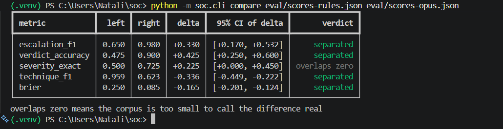
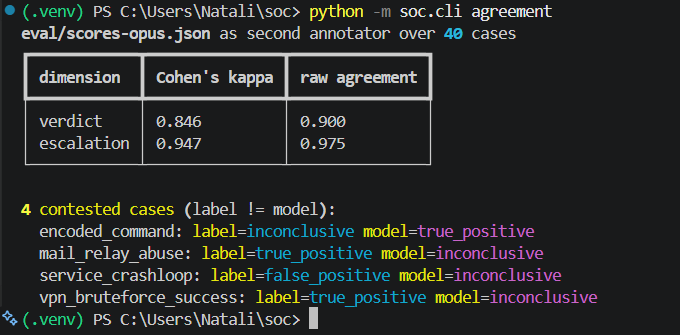

# SOCtriage: illustrated walkthrough

This is the whole system end to end, from the raw alerts a SIEM produces to the model's
verdicts written back into that same SIEM. Every screenshot is from the running lab on one
machine; nothing here is mocked. For the design rationale and the evaluation numbers, see the
[README](../README.md).

---

## 1. What a SIEM gives you

This is Wazuh's own Threat Hunting view, unmodified. In a representative day the lab produced
331 alerts: 79 authentication failures, 31 successes, and the ATT&CK donut on the right showing
the techniques that fired (Password Guessing, SSH, Valid Accounts, Sudo, Create Account).

Everything on this screen is real. The `victim` container runs an actual Wazuh agent, the
attack generator performs real actions on it, and Wazuh's own decoders and roughly 3,000
built-in rules produce these alerts. None of the detection logic is written in this project.

What the dashboard **cannot** tell you is the one thing that matters: did any of those 31
successful logins follow the 79 failures on the same host within a few minutes? That is the
line between internet background noise and an intrusion, and answering it is a tier-1 analyst
reading alerts one at a time, all shift. That gap is the reason this project exists.

---

## 2. The pipeline's first pass

The same alerts, pulled from the indexer and run through the pipeline with the Claude analyst
writing verdicts back to the SIEM (`run --source wazuh --analyst claude --sink indexer`).

Twelve incidents, nine escalated, 16 cents. Each row is one incident: a severity, a verdict, a
confidence, the host, the alert count, and a one-paragraph summary of what happened. The
pipeline correlated 118 raw alerts on `victim01` into the top incident and wrote a single
sentence a human can act on.

The second and third rows are the point of the whole project. The model reports the attacker
brute-forcing the `backup` account, escalating to root, and creating a UID-0 persistence
account, **while separately noting that `natali`, a legitimate admin, was doing routine package
updates on the same host in the same window**. Two actors, one alert stream, correctly pulled
apart. A rule threshold sorts by severity and cannot do this at any confidence, which is
exactly what the evaluation measures and why the LLM analysts beat the baseline on verdict
accuracy.

The bottom three rows are `false_positive` calls, each naming the benign mechanism: the Wazuh
manager's own startup, a 404 scanner, and `natali`'s package upgrade. Getting the false
positives right is half the job, because every needless escalation costs analyst time.

---

## 3. Verdicts back inside the SIEM

The triage output does not stop at a text file. The `indexer` sink writes each verdict back to
the Wazuh indexer as a document in a `soc-triage` index, so the model's conclusions become
first-class, queryable data inside the SIEM's own UI.

This is the Discover view filtered to `triage.escalate: true`, with the verdict fields promoted
to columns. It is the escalation queue: nine incidents the pipeline flagged for a human, sorted
and searchable, each carrying `triage.severity`, `triage.verdict`, and the full narrative in
`triage.summary`. Everything the pipeline dismissed is filtered out of view.

Because each document is keyed by incident id, re-triaging an incident updates its verdict in
place rather than piling up duplicates, so the index always holds the latest call per incident.
Each record also carries the asset context that produced the severity (`asset.criticality`,
`asset.exposure`, `asset.owner`), so a panel like "escalated true positives on crown-jewel
assets" is a single query away.

The other sink, not shown, posts these same escalations to a Slack-compatible webhook, so the
channel becomes a queue of things a human should look at rather than a copy of every alert.

---

## 4. Is it real, or did the model just get lucky?

The three screens above show the system working. They do not, on their own, prove it works
*better than sorting by rule level*. That is a separate question, and the harness answers it.

### The corpus

Everything below is scored against `eval/alerts.jsonl`: 93 Wazuh-shaped alerts forming 40
labelled cases. The balance is deliberate:

- **16 true positives**, spanning credential access, web shells, cron and systemd persistence,
  reverse shells, an `/etc/shadow` read, log tampering, DNS tunnelling, ransomware-style mass
  encryption, VPN and mail abuse, and a sudoers backdoor.
- **16 false positives**, the things that look identical to a threshold but are not attacks:
  package upgrades and removals, certbot renewals, logrotate, config-management pushes,
  developer git activity, CI image churn, a crash-looping service, monitoring probes.
- **8 genuinely ambiguous cases**, where the honest verdict is `inconclusive` with an
  escalation: an off-hours database dump, a dormant account waking up, a login from a new
  country, a lone binary changing with no package to explain it.

The false positives and the ambiguous cases are the point. A threshold escalates on severity,
so it cannot tell a package upgrade from an attacker or admit that a case is genuinely unclear.
The corpus is built to punish exactly that.

### The scoreboard

Three analysts on the same 40 cases. `rules` is the baseline: severity from Wazuh rule level,
escalation above level 10, techniques copied from the firing rules. Square brackets are 95%
bootstrap intervals over the cases; they are wide because 40 is a small number, and they are
shown so no single figure is read as more precise than it is.

| metric | rules baseline | haiku 4.5 | opus 5 |
| --- | --- | --- | --- |
| escalation F1 | 0.650 [0.44, 0.81] | 0.870 [0.74, 0.96] | 0.980 [0.93, 1.00] |
| escalation misses | 11 | 4 | 0 |
| escalation false alarms | 3 | 2 | 1 |
| verdict accuracy | 0.475 [0.33, 0.62] | 0.850 [0.72, 0.95] | 0.900 [0.80, 0.97] |
| severity exact | 0.500 [0.35, 0.65] | 0.575 [0.42, 0.72] | 0.725 [0.57, 0.85] |
| severity within one band | 0.650 | 0.850 | 1.000 |
| technique F1 | 0.959 [0.90, 1.00] | 0.817 [0.70, 0.91] | 0.623 [0.51, 0.73] |
| Brier | 0.250 [0.25, 0.25] | 0.139 [0.06, 0.23] | 0.085 [0.05, 0.13] |
| cost per incident | $0.000 | $0.006 | $0.049 |
| latency p50 | 0 ms | 10,230 ms | 28,523 ms |

Read the rows this way:

- **escalation F1** is the metric that matters most. A miss is an incident nobody looked at; a
  false alarm is wasted analyst time. The baseline misses 11 of the incidents that should
  escalate. Haiku misses 4, Opus misses none.
- **verdict accuracy** is where the threshold collapses. It sits at 0.475, barely a coin flip,
  because it cannot separate a benign package upgrade from an attack. Both models roughly double
  it.
- **Brier** scores the confidence, not just the answer. The baseline reports a flat 0.5 on
  everything, which is what its Brier of 0.250 measures. The models' confidence actually tracks
  whether they are right, so their Brier is much lower.
- **technique F1** is the one row where the baseline "wins", and it is a trap. See the next
  section.
- **cost and latency** are the price of the improvement: a fraction of a cent and ten seconds
  for Haiku, roughly eight times that for Opus.

### Which differences are real

A point estimate on 40 cases moves if a couple of incidents change, so the harness does not
trust the raw numbers. `soc compare` runs a paired bootstrap: resample the cases, rerun both
analysts on the same resample, and look at the distribution of the difference. If that interval
contains zero, the corpus cannot tell the two apart.

Baseline against Opus:

| metric | baseline | opus | delta | 95% CI of delta | verdict |
| --- | --- | --- | --- | --- | --- |
| escalation F1 | 0.650 | 0.980 | +0.330 | [+0.170, +0.532] | separated |
| verdict accuracy | 0.475 | 0.900 | +0.425 | [+0.250, +0.600] | separated |
| severity exact | 0.500 | 0.725 | +0.225 | [+0.000, +0.450] | overlaps zero |
| technique F1 | 0.959 | 0.623 | -0.336 | [-0.449, -0.222] | separated |
| Brier | 0.250 | 0.085 | -0.165 | [-0.201, -0.124] | separated |

Two things are established. The models genuinely beat the threshold baseline on escalation,
verdict accuracy, and calibration, and those wins survive the bootstrap. On the earlier 14-case
corpus none of them did; the difference is sample size, not a change to the models. Severity is
the one improvement the corpus still cannot confirm: the delta is positive but its interval
touches zero.

The technique row separates in the *wrong* direction, and that one is the metric's fault, not
the model's. Opus finds more of the labelled techniques (recall 0.917), but it also adds
techniques the labels do not carry, and the additions are mostly right: `T1595 Active Scanning`
on a 404 sweep, `T1005 Data from Local System` on a `mysqldump --all-databases`. The labels omit
those because they were written to a convention (minimal sets on true positives, empty on false
positives), so `technique_f1` is partly scoring agreement with that convention rather than
correctness, and it penalises the more thorough model for being thorough.

### Are the labels any good?

The obvious objection is that one person wrote all 40 labels, so the whole scoreboard measures
agreement with that one person. `soc agreement` is a partial check.

It treats Opus, which never saw the labels, as an independent second annotator and measures how
often it agrees:

| dimension | Cohen's κ | raw agreement |
| --- | --- | --- |
| verdict | 0.846 | 0.900 |
| escalation | 0.947 | 0.975 |

κ above 0.8 is "almost perfect" agreement by the usual reading, so an independent frontier model
backs the hand labels on 36 of 40 verdicts. The four it disputes are all on the `inconclusive`
boundary, exactly where a real analyst would also hesitate:

| case | label | Opus |
| --- | --- | --- |
| `vpn_bruteforce_success` | true_positive | inconclusive |
| `mail_relay_abuse` | true_positive | inconclusive |
| `service_crashloop` | false_positive | inconclusive |
| `encoded_command` | inconclusive | true_positive |

This does not remove the bias, since the same person wrote the labels and chose the model. It
does name the four cases a second human should adjudicate first, which is more useful than
asserting the single annotator was right. Two independent human annotators remain the real fix.

## The arc

Raw SIEM alerts (1), the pipeline's triage separating attacker from admin (2), verdicts written
back into the SIEM as a searchable escalation queue (3), and an evaluation that establishes the
difference is real while staying honest about what it cannot establish (4). That is the whole
project. The LLM does the tier-1 first pass, its output lands where a real SOC would consume it,
and there are numbers behind the claim rather than a vibe. The design rationale and the full
per-case detail are in the [README](../README.md).
