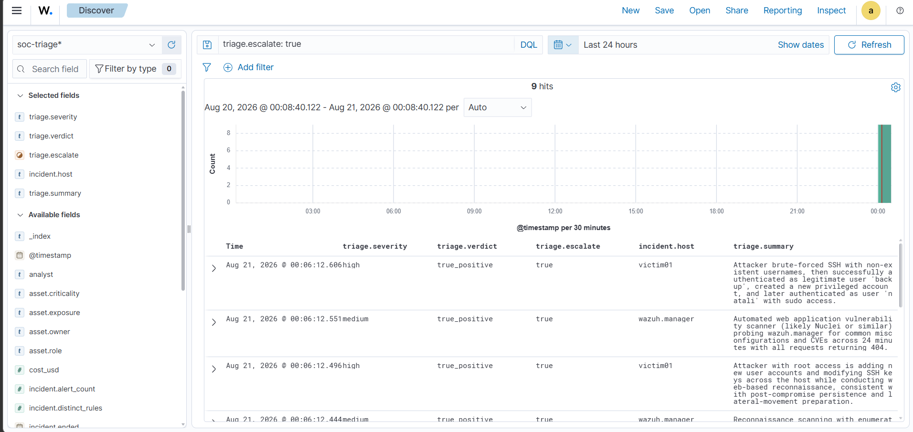

# SOCtriage — illustrated walkthrough

This is the whole system end to end, from the raw alerts a SIEM produces to the model's
verdicts written back into that same SIEM. Every screenshot is from the running lab on one
machine; nothing here is mocked. For the design rationale and the evaluation numbers, see the
[README](../README.md).

---

## 1. What a SIEM gives you

This is Wazuh's own Threat Hunting view, unmodified. In a representative day the lab produced
331 alerts: 79 authentication failures, 31 successes, and the ATT&CK donut on the right showing
the techniques that fired (Password Guessing, SSH, Valid Accounts, Sudo, Create Account).

Everything on this screen is real. The `victim` container runs an actual Wazuh agent, the
attack generator performs real actions on it, and Wazuh's own decoders and roughly 3,000
built-in rules produce these alerts. None of the detection logic is written in this project.

What the dashboard **cannot** tell you is the one thing that matters: did any of those 31
successful logins follow the 79 failures on the same host within a few minutes? That is the
line between internet background noise and an intrusion, and answering it is a tier-1 analyst
reading alerts one at a time, all shift. That gap is the reason this project exists.

---

## 2. The pipeline's first pass

The same alerts, pulled from the indexer and run through the pipeline with the Claude analyst
writing verdicts back to the SIEM (`run --source wazuh --analyst claude --sink indexer`).

Twelve incidents, nine escalated, 16 cents. Each row is one incident: a severity, a verdict, a
confidence, the host, the alert count, and a one-paragraph summary of what happened. The
pipeline correlated 118 raw alerts on `victim01` into the top incident and wrote a single
sentence a human can act on.

The second and third rows are the point of the whole project. The model reports the attacker
brute-forcing the `backup` account, escalating to root, and creating a UID-0 persistence
account, **while separately noting that `natali`, a legitimate admin, was doing routine package
updates on the same host in the same window**. Two actors, one alert stream, correctly pulled
apart. A rule threshold sorts by severity and cannot do this at any confidence, which is
exactly what the evaluation measures and why the LLM analysts beat the baseline on verdict
accuracy.

The bottom three rows are `false_positive` calls, each naming the benign mechanism: the Wazuh
manager's own startup, a 404 scanner, and `natali`'s package upgrade. Getting the false
positives right is half the job, because every needless escalation costs analyst time.

---

## 3. Verdicts back inside the SIEM

The triage output does not stop at a text file. The `indexer` sink writes each verdict back to
the Wazuh indexer as a document in a `soc-triage` index, so the model's conclusions become
first-class, queryable data inside the SIEM's own UI.

This is the Discover view filtered to `triage.escalate: true`, with the verdict fields promoted
to columns. It is the escalation queue: nine incidents the pipeline flagged for a human, sorted
and searchable, each carrying `triage.severity`, `triage.verdict`, and the full narrative in
`triage.summary`. Everything the pipeline dismissed is filtered out of view.

Because each document is keyed by incident id, re-triaging an incident updates its verdict in
place rather than piling up duplicates, so the index always holds the latest call per incident.
Each record also carries the asset context that produced the severity (`asset.criticality`,
`asset.exposure`, `asset.owner`), so a panel like "escalated true positives on crown-jewel
assets" is a single query away.

The other sink, not shown, posts these same escalations to a Slack-compatible webhook, so the
channel becomes a queue of things a human should look at rather than a copy of every alert.

---

## The arc

Raw SIEM alerts (1) → the pipeline's triage, separating attacker from admin (2) → verdicts
written back into the SIEM as a searchable escalation queue (3). That is the complete loop: the
LLM does the tier-1 first pass and its output lands where a real SOC would consume it.

What makes it a project rather than a demo is the layer these screenshots do not show: a
40-case labelled corpus, a threshold baseline, bootstrap confidence intervals, and a paired
significance test that establishes the models genuinely beat the baseline rather than just
asserting it. Those numbers, and their limits, are in the [README](../README.md).
